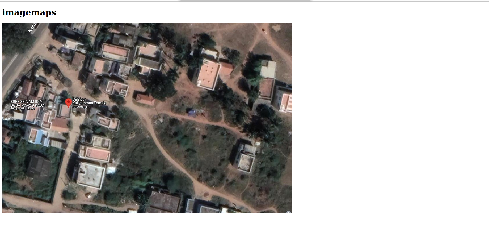
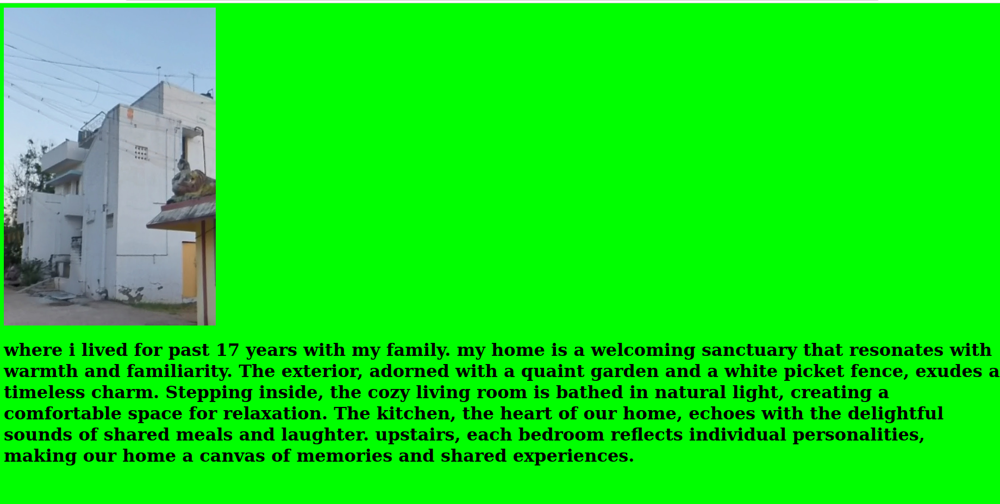
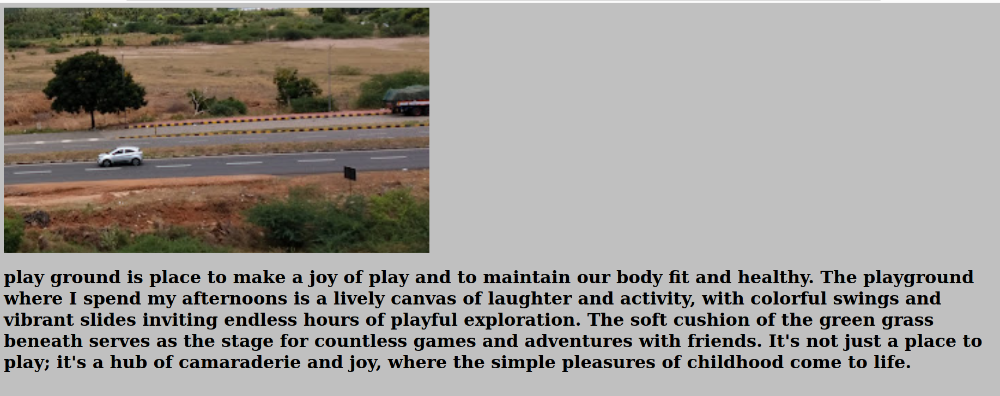
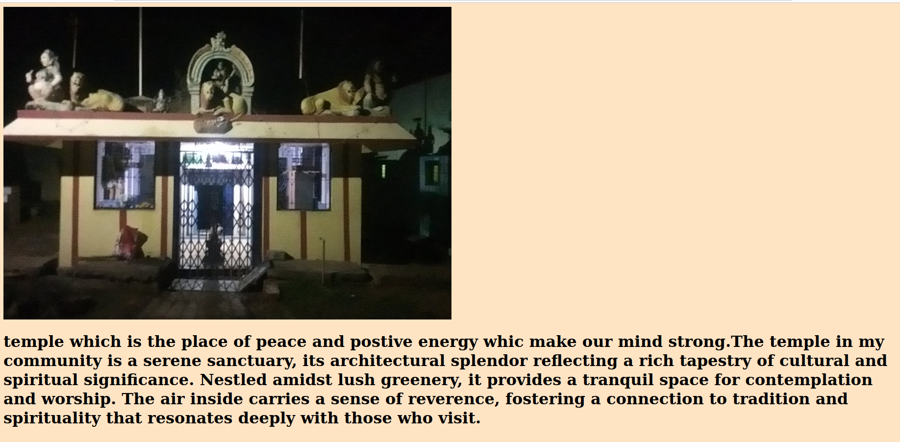
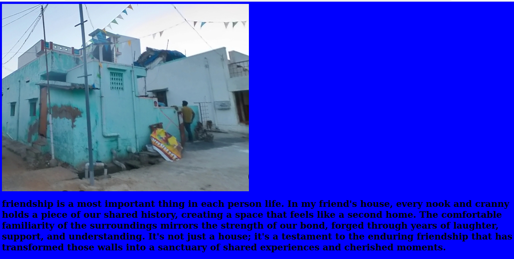
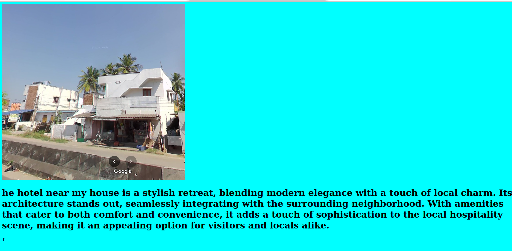

# Places Around Me
## AIM:
To develop a website to display details about the places around my house.

## Design Steps:

### Step 1:
clone the repository
### Step 2:
add the html files and run the django project
## Code:
Include your HTML code here
### map.html:
```html
<!DOCTYPE html>
<html lang="en">
<head>
    <title>imagemaps demo</title>
</head>
<body>
    <h1>imagemaps</h1>
    
    <map name="image_map">
  <area alt="my home" title="my home" href="myhome.html" coords="391,369,74" shape="circle">
  <area alt="playground" title="playground" href="play ground.html" coords="527,341,878,543" shape="rect">
  <area alt="temple" title="temple" href="temple.html" coords="201,279,311,356" shape="rect">
  <area alt="friend house" title="friend house" href="friend house.html" coords="695,132,872,242" shape="rect">
  <area alt="hotel" title="hotel" href="hotel.html" coords="24,228,168,347" shape="rect">
</map>
</body>
</html>
```

### my home.html
```html
<!DOCTYPE html>
<html lang="en">
<head>
    <title>my home</title>
</head>
<body bgcolor="#00FF00">
    
    <h1>where i lived for past 17 years with my family.
         my home is a welcoming sanctuary that resonates with warmth and familiarity. 
         The exterior, adorned with a quaint garden and a white picket fence, exudes a timeless charm. 
         Stepping inside, the cozy living room is bathed in natural light, creating a comfortable space for relaxation. 
         The kitchen, the heart of our home, echoes with the delightful sounds of shared meals and laughter. 
         upstairs, each bedroom reflects individual personalities, making our home a canvas of memories and shared experiences.</h1>
</body>
</html>
```
### playground.html
```html
<body bgcolor="#C0C0C0">
    
    <h1>play ground is place to make a joy of play and to maintain our body fit and healthy. 
        The playground where I spend my afternoons is a lively canvas of laughter and activity, with colorful swings and vibrant slides inviting endless hours of playful exploration.
         The soft cushion of the green grass beneath serves as the stage for countless games and adventures with friends.
          It's not just a place to play; it's a hub of camaraderie and joy, where the simple pleasures of childhood come to life. </h1>
```
### temple.html
```html
<body bgcolor="#FFE4C4">
    
    <h1>temple which is the place of peace and postive energy whic make our mind strong.The temple in my community is a serene sanctuary, its architectural splendor reflecting a rich tapestry of cultural and spiritual significance. Nestled amidst lush greenery, it provides a tranquil space for contemplation and worship. The air inside carries a sense of reverence, fostering a connection to tradition and spirituality that resonates deeply with those who visit.</h1>
</body>
```
### friend house.html
```html
<body bgcolor="blue">
    
    <h1> friendship is a most important thing in each person life.
         In my friend's house, every nook and cranny holds a piece of our shared history, creating a space that feels like a second home. 
         The comfortable familiarity of the surroundings mirrors the strength of our bond, forged through years of laughter, support, and understanding. 
         It's not just a house;
         it's a testament to the enduring friendship that has transformed those walls into a sanctuary of shared experiences and cherished moments. </h1>
</body>
```
### hotel.html
```html
<body bgcolor="aqua">
    
    <h1> he hotel near my house is a stylish retreat, blending modern elegance with a touch of local charm. 
    Its architecture stands out, seamlessly integrating with the surrounding neighborhood. 
    With amenities that cater to both comfort and convenience, it adds a touch of sophistication to the local hospitality scene, making it an appealing option for visitors and locals alike.</h1>T
</body>
```
## Output:
Include your output screenshot here







## Result:
the program is executed successfully.